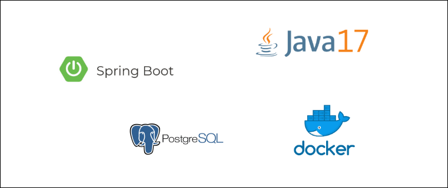

# MicroServiço - Gestão de Logistica para Entrega de Pedidos

Micro serviço com a responsabilidade de montar a logistica de entrega de produtos 

- Controle de Envios
- Logistica de seleção de transportadoras / Entregadores

## Stack

- Java 17
- Spring Boot
- Docker
- PostGreSQL



## Iniciar ambiente dev/local

Inicia containers e configura aplicação. Url de acesso: http://localhost:8084/api/v1

```shell
make dev/local
```
ou
``` shell
docker-compose up -d 
```

## Preparar Banco de Dados

Ao iniciar o projeto será executado um job para carga inicial de transportadoras

> *Atenção:*
>> Para utilização do micro-serviços em ambiente local é necessário a inclusão das transportadoras.
>>
>> Em caso de não execução do JOB inicial executar o seguinte script: [Script SQL](src/main/resources/data.sql)

## Documentação API

- [Criar um Envio de Pedido](docs/create.md)
- [Pesquisar Listar Envios](docs/shipping.md)
- [Processar Envio](docs/process.md)
- [Finalizar Envio](docs/finished.md)
- [Pesquisar Listar Rastreios](docs/tracking.md)
- [Listar Transportadoras](docs/carriers.md)

### Swagger
http://localhost:8084/swagger-ui/index.html