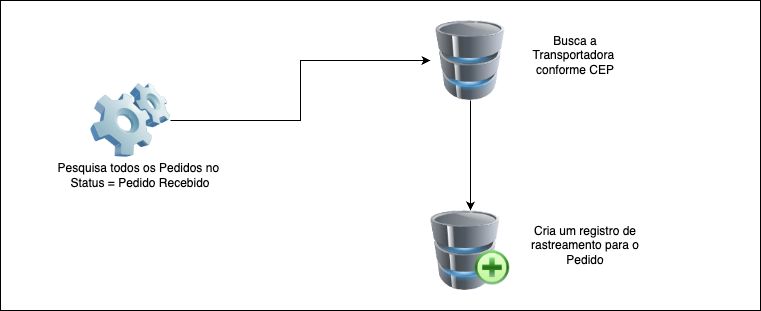

### Processo responsável por associar a transportadora ao envio

Processo efetua a associação do pedido a transportadora e prepara a rota de envio.

- **Método:** `POST`
- **Ponto de acesso:** `api/v1/shippings/process`
- **Código HTTP:** `204 NO CONTENT`

#### Parâmetro

```shell
curl --location --request POST 'http://localhost:8084/api/v1/shippings/process'
```
    GET  api/v1/shippings/process

#### Fluxo do Processo



[< Voltar para o índice](../README.md)
